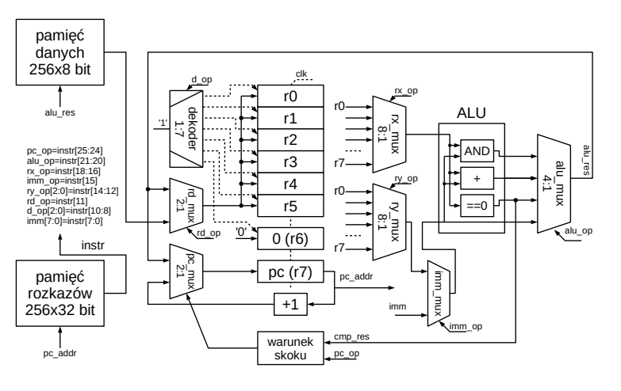

# Czym jest procesor

Główną róznicą pomiędzy układami reprogramowalnymi FPGA a układami programowalnymi (mikroprocesory czy CPU) jest to, ze w tych pierwszych architektura przetwarzająca dane moze
być dowolnie zmieniana (rekonfigurowana, reprogramowana). W procesorach już na etapie projektowania okresla się liczbę rejestrów, szerokość magistrali danych oraz operacje które bedą realizowane w jednostce arytmetyczno-logicznej (ALU). Na etapie produkcji bloki te zostają zrealizowane na stałe w krzemie jako grupy połączonych ze sobą bramek logicznych. W związku z tym, istnieje określona, z góry ograniczona liczba podstawowych instrukcji, które mogą być wykonywane. Uzytkownik nie ma możliwości zmiany tej architektury, może natomiast zmieniać program, który będzie na niej wykonywany. To od sekwencji instrukcji dostarczonych przez programistę zależy, które dane są pobierane z pamięci do rejestrów, które operacje na tych danych są wykonywane w jednostce arytmetyczno-logicznej i gdzie zapisywane są wyniki. Program jest pewną sekwencją instrukcji, która, w zalezności od ich kolejności, umożliwia rozwiązanie róznych problemów obliczeniowych. Skoro jednak w układzie FPGA można realizować dowolne architektury sprzętowe, możliwe jest także połączenie zasobów rekonfigurowalnych w ten sposób, aby realizowały one funkcjonalności procesora. Takie podejście, w którym procesor jest zrealizowany nie w postaci na stałe ustalonych połaczeń w krzemie, ale w postaci odpowiednio skonfigurowanych zasobów układu FPGA jest określane mianem soft-procesora.

# Architektura zaimplementowanego procesora na FPGA

